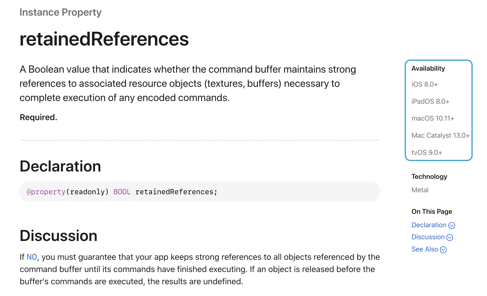

# Contributing to Metal.jl

This package can always use more functionality and contributors. If you're a user of this
package or just want to get more exposure to these things, there are many easy ways to
contribute. Check out the issues on GitHub or look at the [Metal Shading Language
Specification](https://developer.apple.com/metal/Metal-Shading-Language-Specification.pdf)
for unimplemented features you could add. Here are some tips for contributing to Metal.jl:

## How to wrap new CMT Functionality

There are unimplemented features of the Metal Shading Language that need low-level wrappers
around their Objective-C interface. To wrap them, look at the top-level cmt folder. Add the
wrappers following the existing structure (TODO: Explain naming structure).

Once they're added, build cmt to make sure your additions didn't generate new errors. From
the top-level Metal.jl directory run `julia --project=deps deps/build.jl`.
Next, you'll need to re-wrap cmt to create Julia wrappers for the Objective-C functions by
running (also from the top-level Metal.jl directory) `julia --project=res res/wrap.jl`.

Let's look at the command buffer descriptor object as an example (in _command\_buf.m_):

```objective-c
MT_EXPORT
MT_API_AVAILABLE(mt_macos(10.11), mt_ios(8.0))
bool
mtCommandBufferDescriptorRetainedReferences(MtCommandBufferDescriptor *desc) {
  return (bool)[(MTLCommandBufferDescriptor*)desc retainedReferences];
}
```

Most of these functions will have a specified minimum OS version for each of Apple's
operating systems. Be sure to correctly set these values. They can be found by going to
the Apple documentation webpage for the function/property of interest and looking at the
right side of the webpage (see the example below).



The currently used naming convention for the low-level Objective-C interface is as follows:
- 'mt': Prefix that indicates a low-level Metal call
- Object type ('CommandBufferDescriptor')
- For getters and setters:
    - Property name ('RetainedReferences')
- For setters only:
    - 'Set': Indicates a setter function

Depending on what is added, types or enums will need to be defined in
`cmt/include/cmt/types_metal.h` and `cmt/include/cmt/enums.h`.
respectively.

To then create high-level Julia constructs, follow the naming conventions of the existing
API.
- 'Mt': Objective-C type/enum
- 'MTL': Pointer to an Objective-C NSObject
- 'Mtl': High-level Julia struct

Example:

```julia
const MTLDevice = Ptr{MtDevice}

struct MtlDevice
    handle::MTLDevice
end
```
The Julia structures representing most of the Objective-C objects will contain a pointer
handle to the NSObject and optionally some additional fields. If in doubt, follow the
existing APIs or ask for guidance on Slack.

## Metal Performance Shaders

TODO


## Other

It is also helpful to evaluate CPU implementations (with or without vectorized
instructions) against their GPU counterparts (user or MPS kernels). With unified memory,
the performance considerations between the implementations are especially important. This
data can be used to create better heuristics for when to dispatch to the various hardware
accelerators.


## Helpful Links

[Metal API Documentation](https://developer.apple.com/documentation/metal?language=objc)

[Metal Shading Language Specification
](https://developer.apple.com/metal/Metal-Shading-Language-Specification.pdf)

[Metal Performance Shaders
](https://developer.apple.com/documentation/metalperformanceshaders?language=objc)
